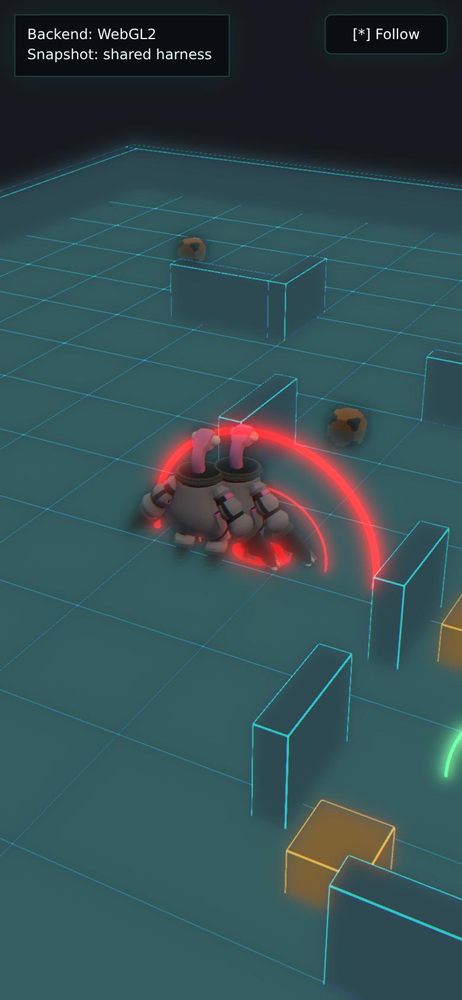

# Babylon Duel + Telefrag Prototype Scorecard

Throwaway Babylon.js substrate bet for the shared brutal duel followed by the
airdrop telefrag -> red mist money-shot. This is not production code and is not
wired to live Convex.

## 1. Compressed Cold-Load Size + Time-To-First-Frame

Round 2 refreshed on May 20, 2026 in headless Chromium 147 using Chrome
DevTools Protocol throttling: 390x844 mobile viewport, DPR 2, 150 ms latency,
200 KiB/s download, 75 KiB/s upload, and 4x CPU slowdown. The renderer in this
environment was WebGL2 over ANGLE/SwiftShader, so this remains a
software-renderer caveat, not a real phone GPU result.

- Build output: `npm run build` passed; main JS bundle
  `dist/assets/index-7e1X9sjv.js` is 2,305,560 bytes raw / 545,938 bytes gzip.
- Full built `dist/` payload if every file is gzip-compressed:
  4,983,495 bytes raw / 1,415,452 bytes gzip.
- Cold-load transfer measured from a gzip static server: 1,042,641 encoded
  bytes over 72 completed requests, with first non-blank canvas frame at
  3,252 ms and app readiness marker at 474 ms.
- The payload moved only slightly from Round 1 despite the VFX uplift; the
  first-frame number was materially better in this measurement pass. The
  separate Vite-preview FPS cross-check was not rerun for Round 2.

## 2. WebGPU vs WebGL2

Round 2 did not change this axis; the Round-1 finding is retained.
Default startup in this environment fell back to WebGL2. `navigator.gpu` was
present, but `requestAdapter()` returned no adapter and Babylon logged
`No available adapters.` The observed default path reported `Backend: WebGL2`.

Forced WebGL2 fallback, by hiding `navigator.gpu`, matched the default result:
1,513,893 encoded bytes, first ready frame at 3,497.2 ms, and 7.10 fps over a
3.10 s sample. A separate forced WebGPU browser-flag attempt did reach the
`Backend: WebGPU` label, but the headless compositor produced a blank canvas
with swap-chain/shared-image errors, so there is no valid WebGPU visual or perf
delta from this environment.

## 3. Convex / JSON Binding Effort

Binding effort is light. The prototype has no live Convex dependency:
`src/snapshot.ts` fetches `/shared-harness/replay-snapshot.json` in
`loadReplaySnapshot()`, then `normalizeSnapshot()` adapts the static harness
into the local `ReplaySnapshot` shape. It accepts
`timeline.frames[].snapshot` objects shaped like the `EntitySnapshot` contract
from `apps/replay/src/lib/reconstruct.ts`: `turn`, `characters`, `corpses`,
`crates`, `airdrops`, and `evacRevealed`. `normalizeMoneyShot()` maps the
harness `highlightedEvent` / `playback` fields into the local `moneyShot`
object, and `normalizeDuel()` reads the additive `highlightedEvents` duel
metadata for the Round-2 choreography. `fallbackSnapshot` is only a
degraded-mode safety net when the shared harness cannot be loaded; it is not
the bound path.

Actual glue-code path: `throwaway-prototypes/a-babylon/src/snapshot.ts`.

## 4. Did The Telefrag Land?

Yes. The survivor walks into the public airdrop marker after the duel, the
crate descends on the occupied tile, the victim is removed, and the impact now
throws a red beam, expanding in-scene cloud, smoke/spark burst, glow pulse, and
camera punch. The red-mist beat is no longer just a flat ring treatment; it is
still stylized, but it reads as a proper Babylon VFX moment rather than missing
parity with the other Round-1 arms.

## 5. Round-2 polish — what changed

The shared harness now runs a 30-second deterministic loop: Sprinter and
Vulture close, exchange hits, Sprinter lands the killing blow, Vulture leaves a
corpse marker, then Sprinter walks into the existing `Crate_50_50` airdrop
telefrag. Babylon consumes the additive duel metadata without hard-coded
fixture IDs, and the scene got a focused VFX uplift: duel trace beams,
hit-spark/blood/smoke particle systems, a readable corpse glow, kill-cam
framing, camera shake/punch, animated post-process bloom/chromatic pulses, and
the missing telefrag red-mist cloud. Models and the fixed CC0 Quaternius kit
were left unchanged.

## 6. Felt read on the brutal duel

The duel reads as a canned kill beat rather than combat simulation: two agents
close from the fixture, the winner hits through the loser with a bright trace,
the camera tightens, and the aftermath leaves the body in a red-lit pool before
the survivor peels toward the airdrop. It is still a throwaway prototype, but
the money-shot is now shareable enough to evaluate Babylon's pipeline ceiling
instead of judging Round 1's flat effect pass.

- Still capture: `telefrag-capture.png`
- Loop capture: `telefrag-capture.gif`



## 7. Productionization + Asset-License Posture

Asset posture is clean for a throwaway prototype. The shared fixed art kit is a
minimal subset of Quaternius' Ultimate Space Kit, sourced from OpenGameArt /
Quaternius and documented in `../shared-harness/art-kit/manifest.json` as
`CC0-1.0`; attribution is not required, though provenance is retained.

Productionization work would include real device profiling, bundle splitting or
more selective Babylon imports, optimized GLB / texture delivery, an explicit
debug backend switch, removal of the fallback snapshot, live Convex query
binding, and a more intentional asset/VFX pass. None of that belongs in this
throwaway comparison artifact.

## 8. Run Command

From `throwaway-prototypes/a-babylon`:

```bash
npm run dev
```

`predev` runs `npm run sync:harness`, copying `../shared-harness` into
`public/shared-harness`, then Vite serves the browser prototype at
`http://localhost:5174/` unless that port is occupied. Clean-state verification
was `npm install` followed by the dev command; the shared snapshot loaded with
`Snapshot: shared harness`.

For container or Traefik forwarding, Vite's host flag is preserved:

```bash
npm run dev -- --host 0.0.0.0
```
