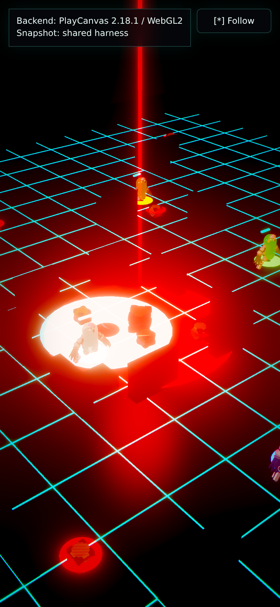

# PlayCanvas Telefrag Prototype Scorecard

Throwaway PlayCanvas substrate bet for the shared airdrop telefrag -> red mist
money-shot. This is not production code and is not wired to live Convex.

## 1. Compressed Cold-Load Size + Time-To-First-Frame

Measured on May 19, 2026 in headless Chromium 147 using Chrome DevTools
Protocol throttling: 390x844 mobile viewport, DPR 2, 150 ms latency,
200 KiB/s download, 75 KiB/s upload, and 4x CPU slowdown. The renderer in
this environment was PlayCanvas WebGL2 over headless Chromium software/GPU
emulation, so visual frame pacing is a local caveat, not a real phone GPU
result.

- Build output: `npm run build` passed; main JS bundle
  `dist/assets/index-oQNwKrck.js` is 2,096,424 bytes raw / 532,440 bytes gzip.
- Full built `dist/` payload if every file is gzip-compressed:
  3,177,568 bytes raw / 988,097 bytes gzip.
- Cold-load transfer measured from a gzip static server: 853,696 encoded bytes
  over 6 completed requests, 0 failed requests.
- First non-blank canvas frame: 2,998 ms. The app-ready marker fired at 471 ms,
  before the first meaningful canvas paint, so the visual first-frame number is
  the one to compare.

Measurement helper used: `scripts/measure-scorecard.mjs`.

## 2. WebGPU vs WebGL2

N/A for this prototype. It is intentionally WebGL2-first and creates the
PlayCanvas graphics device with `DEVICETYPE_WEBGL2`. There is no WebGPU code
path or runtime toggle here, so there is no honest visual/perf delta to report.
The observed status label was `Backend: PlayCanvas 2.18.1 / WebGL2`.

## 3. Convex / JSON Binding Effort

Binding effort is light. The prototype has no live Convex dependency:
`src/snapshot.ts` fetches `/shared-harness/replay-snapshot.json` in
`loadReplaySnapshot()`, then `normalizeSnapshot()` adapts the shared harness
into the local `ReplaySnapshot` shape. It consumes
`timeline.frames[].snapshot` objects shaped like the `EntitySnapshot` contract
from `apps/replay/src/lib/reconstruct.ts`: `turn`, `characters`, `corpses`,
`crates`, `airdrops`, and `evacRevealed`. `normalizeMoneyShot()` maps the
harness `highlightedEvent` and `playback` fields into the local money-shot
object. `fallbackSnapshot` is only a degraded-mode safety net when the shared
harness is absent.

Actual glue-code path: `throwaway-prototypes/b-playcanvas/src/snapshot.ts`.

## 4. Did The Telefrag Land?

Yes, directionally. The scene reads as a public red warning beam, a crate
falling onto the occupied tile, the victim disappearing with no corpse, and a
red impact wash / shockwave / mist cloud. It lands the core beat, but it is less
viscerally refined than the Babylon version: the PlayCanvas throwaway leans on
simple primitives, bloom-like camera framing, and hand-built effects rather than
a rich particle/post stack. That is useful signal for this substrate comparison.

The GIF/still were captured from the built app with `?speed=3` only to keep the
headless software-renderer capture brief; the normal run command uses default
playback speed.

- Still capture: `telefrag-capture.png`
- Loop capture: `telefrag-capture.gif`



## 5. Productionization + Asset-License Posture

Asset posture is clean for a throwaway prototype. The fixed shared art kit is a
minimal subset of Quaternius' Ultimate Space Kit, sourced from OpenGameArt /
Quaternius and documented in `../shared-harness/art-kit/manifest.json` as
`CC0-1.0`; attribution is not required, though provenance is retained.

Productionization work would include real device profiling, trimming the copied
public harness to only files actually requested, optimized GLB/texture delivery,
choosing whether to use PlayCanvas Editor assets or code-only scene assembly,
removing the fallback snapshot, live Convex query binding, and a more deliberate
VFX pass. None of that belongs in this throwaway comparison artifact.

## 6. Run Command

From `throwaway-prototypes/b-playcanvas`:

```bash
npm run dev
```

`predev` runs `npm run sync:harness`, copying `../shared-harness` into
`public/shared-harness`, then Vite serves the browser prototype at
`http://localhost:5175/` unless that port is occupied. Clean-state verification
was `npm install` followed by the dev command; the shared snapshot loaded with
`Snapshot: shared harness`.
