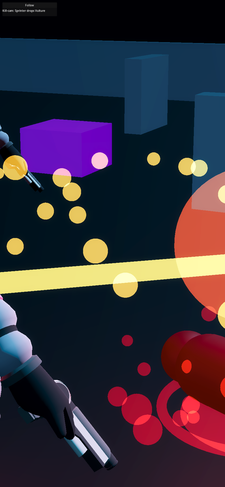

# Godot WASM Duel + Telefrag Control Arm

Throwaway Godot 4.6.2 web export of the same shared replay slice used by
`a-babylon` and `b-playcanvas`: Sprinter kills Vulture in a canned duel, walks
into the airdrop zone, then gets telefragged into red mist/no corpse. This is
intentionally a control arm for WASM payload and JS<->WASM data-binding
friction, not a production direction.

## 1. Compressed Cold-Load + Time-To-First-Frame

Round 2 measured on May 20, 2026 with `node scripts/measure-scorecard.mjs --out scorecard-measurement.json --timeout-ms 120000 --network-idle-ms 2000 --ready-grace-ms 5000` against the committed `dist/` export, served gzip with COOP/COEP headers.

- Profile: 390x844 CSS px, DPR 2, 150 ms latency, 200 KiB/s download, 75 KiB/s upload, 4x CPU slowdown.
- Full `dist/` payload if gzip-compressed: `10,670,065` bytes (`39,944,744` raw).
- Main payloads: `index.wasm` `37,695,054` raw / `9,469,248` gzip; `index.pck` `781,848` raw / `658,196` gzip; `index.js` `315,759` raw / `78,949` gzip.
- First non-blank page is now the custom loading screen at `724 ms`; app ready marker is `51,005 ms`.

The visible boot state moved earlier because the default splash was replaced with a custom loader. The structural control-arm finding did not move: CDP still reports `encodedDataLength: 0` for the WASM/PCK `Fetch` bodies even though the server delivers them, so the payload headline above uses the deterministic gzip analysis of `dist/`, not the incomplete CDP transfer sum. The `9.47 MB` gzip WASM floor is unchanged by design.

## 2. WebGPU vs WebGL2

N/A by substrate. Godot 4 Web exports target WebGL2 through the Compatibility renderer and do not provide a WebGPU backend for this path. I first tried the threaded web export to match the classic SharedArrayBuffer requirement; in headless Chromium it stalled at Emscripten `loading-workers` despite COOP/COEP. The committed export uses Godot 4.6's single-thread web template so it actually opens, while `npm run serve` still sends `Cross-Origin-Opener-Policy: same-origin` and `Cross-Origin-Embedder-Policy: require-corp` because that header ceremony is part of the control-arm friction.

## 3. Convex/JSON-Binding Effort

The runtime data path is deliberately awkward: `src/Main.gd::_load_snapshot_via_js_bridge()` calls `JavaScriptBridge.eval()` with a synchronous browser `XMLHttpRequest` for `/shared-harness/replay-snapshot.json`, returns the raw JSON string across the JS<->WASM boundary, then parses and normalizes it in GDScript. Round 2 adds `highlightedEvents` duel metadata normalization while preserving the legacy `highlightedEvent` airdrop path. The web export also writes `window.__telefragBridge` and `window.__telefragReadyAt` for measurement. This proved the pillar-7 contract shape can cross into Godot, but the glue is blocking, stringly, and much less natural than the JS-native prototypes' `fetch()` + typed normalization path.

Actual glue path: `throwaway-prototypes/c-godot-wasm/src/Main.gd`; served fixture path: `throwaway-prototypes/c-godot-wasm/dist/shared-harness/replay-snapshot.json`, byte-identical to `throwaway-prototypes/shared-harness/replay-snapshot.json`.

## 4. Did The Duel + Telefrag Land?

Capture artifacts:

- `telefrag-capture.png`
- `telefrag-capture.gif`

Subjective call: yes, and it still feels like the control arm. The duel now reads before the airdrop: Sprinter and Vulture close, clash, the camera dives into a kill-cam framing, and Vulture leaves a readable corpse marker before Sprinter walks into the drop zone. The telefrag beat remains legible: the warning beam anchors the tile, the crate lands, Sprinter disappears, and red mist fills the impact zone with no corpse. The imported astronauts still give Godot the best model read of the three, but the WASM boot cost and JS<->WASM glue remain the main negative findings.

## 5. Round-2 polish — what changed

Round 2 consumes the byte-identical extended fixture from `shared-harness` and scripts the Godot scene from that data: additive `highlightedEvents` duel metadata drives Sprinter/Vulture timing, slash traces, impact flashes, spark/blood bursts, corpse readability, and the survivor's staged walk into the existing airdrop telefrag. The Godot-specific polish pass replaces the default engine splash with a custom cyberpunk-register HTML loading screen in the export pipeline, with project boot-splash settings as defense in depth. The kill-cam is a Godot `Camera3D` move and FOV punch over the duel finisher; no new assets, model churn, shared library, live Convex wiring, or WASM shrink work was added.

## 6. Felt read on the brutal duel

The duel lands as the best cheap payoff for this arm: the camera gets close enough to let the Quaternius astronaut models carry the moment, the yellow slash and red burst make the killing blow readable, and the corpse marker gives a clear before/after state before the scene widens back out for the airdrop. It is still blunt compared with a dedicated VFX pipeline, but the point of this arm is clearer now: Godot can make the models and kill-cam feel crisp, while the 9.5 MB WASM floor remains the structural tradeoff.



Loop capture: `telefrag-capture.gif`

## 7. Productionization + Asset-License Posture

Assets are the same fixed CC0 Quaternius Ultimate Space Kit subset documented in `shared-harness/art-kit/manifest.json`:

- `Astronaut.glb`
- `Pickup Crate.glb`
- `Base Large.glb`
- `Building L.glb`

Productionizing this path would require a real Godot export pipeline, a decision on threaded vs single-thread web exports, explicit browser/mobile QA, asset import hygiene, and a non-blocking bridge from Convex JSON into GDScript. The engine/license posture is workable for a prototype, but the unchanged `9.47 MB` gzip WASM floor and bridge friction are the central negative findings.

## 8. Run Command

From the repo root:

```bash
cd throwaway-prototypes/c-godot-wasm && npm run serve -- --host 0.0.0.0 --port 8062 --gzip
```

The committed `dist/` opens directly from that command; add `--open` if you want the helper to launch a local browser. To rebuild the export, install Godot 4.6.2 plus matching web export templates, then run:

```bash
cd throwaway-prototypes/c-godot-wasm && GODOT_BIN=/tmp/context-battler-godot/Godot_v4.6.2-stable_linux.arm64 npm run build
```

The local server always serves with COOP/COEP and `application/wasm` for `.wasm`.
